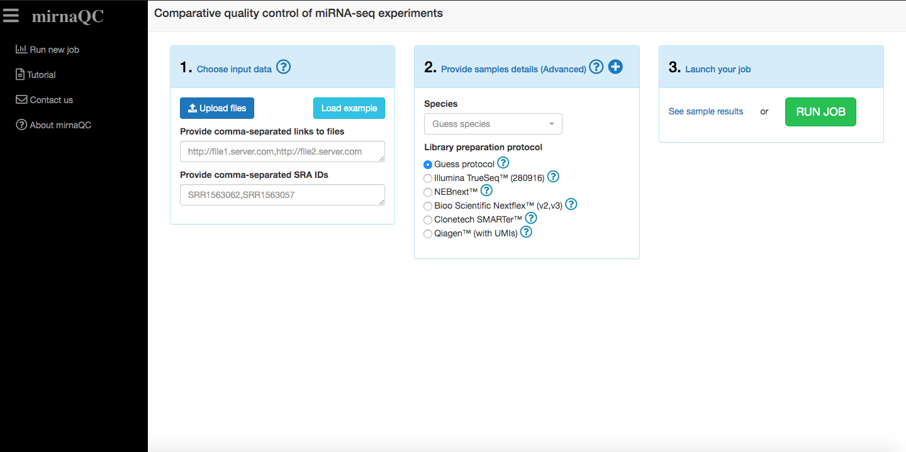
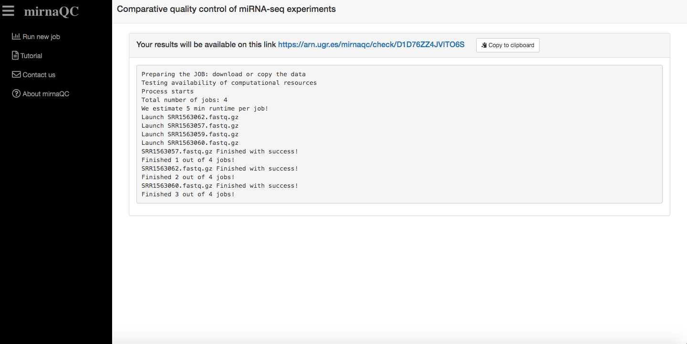
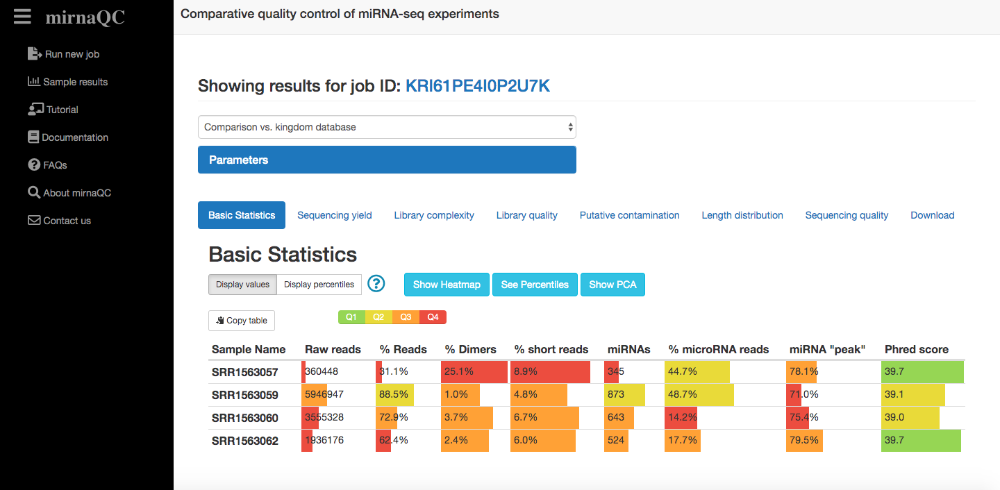

# Welcome to mirnaQC documentation page

mirnaQC is a webserver dedicated to miRNA-seq Quality Control. 
mirnaQC provides several quality features that can help researchers identify issues in their samples. 
These features are provided as absolute values and ranked with a percentile calculated from a corpus of more than 36,000 samples.

## Availability
To use mirnaQC webserver visit [arn.ugr.es/mirnaqc/](https://arn.ugr.es/mirnaqc/)

## Quick Start
mirnaQC is quite intuitive so we recommend to go ahead and try to explore the tool by yourself.
Here we provide a basic description of the analysis available.

## Input data

You can see an interactive tutorial [here](https://arn.ugr.es/mirnaqc/tourstart)

mirnaQC will calculate quality control parameters for each of the miRNA-seq samples provided. Several input formats are supported and they can all be combined: 

+  `Reads files` can be directly uploaded to the page (fastq, fastq.gz).
+  `Links to files` can be pasted. More than one can be provided if they are comma-separated.
+  `SRA run accessions` (they start with SRR, ERR or DRR e.g. SRR1563062) can be pasted. More than one can be provided if they are comma-separated.
+  `zip files` zipped files (.zip, .7z, .tar.gz or .tgz) containing one or several samples can also be uploaded. They need to have the correct extension (.zip, .7z, .tar.gz or .tgz).
Zip files (need to have extension 'zip' like reads.zip), gzipped tar files (extension tar.gz or' tgz' like reads.tar.gz or reads.tgz) or 7z files (extension '7z' like reads.7z). 
 
Please note that we recommend uploading your files to a server and providing links. 
This will help jobs run faster and files can be reused.

Technical details should also be provided (if available) to ensure your samples are profiled correctly.
If these are not provided mirnaQC will try to guess them.

## Queue system
To ensure our servers do not collapse, jobs are run sequentially. Once a job has been correctly placed in queue, a view will be displayed to inform of job progress.
Once a job starts running, it should take approximately 5 minutes per sample. Of course this can vary depending on input size.

## Results page

You can see an interactive tutorial [here](https://arn.ugr.es/mirnaqc/tourresults/T227DTB9FS2ZBU9)

## Report sections

**Sequencing yield**

This section focuses on the amount of reads and the fraction that can be assigned to known miRNAs. Generally parameters in this category (percentage of valid reads, detected microRNAs) indicate high quality when they hold high values. Low numbers (especially for the percentage of valid input reads) can be related to problems in most aspects of RNA processing or low input. Some sources like exosomes extracted from bodily fluids however, are known to hold low levels of miRNA, thus high numbers should not be expected for all sample types even for high quality libraries.

**Library quality**

In this category we list the number of reads that are filtered out due to minimal length (15nt), the percentage of ribosomal RNA and the percentage of short reads (15-17 nt) which might be degradation products from longer RNA molecules as no small RNAs are known in this length range. 
High percentages of adapter-dimers (0, 1 or 2nt fragments after trimming) normally indicate issues with the ratio of adapter to input RNA concentration. In practice, it is very difficult to completely avoid adapter-dimers, especially in low input samples such as blood, but the percentile may show a reasonable potential of improvement. 
Ultra-short reads are defined as fragments with lengths between 3nt and 14nt (both inclusive).  

**Library complexity**

In general it is also interesting to assess the complexity of the sample since low complexity libraries provide very little information, even for a high quality sequencing, which is not desired. Several measurements are provided to grasp the complexity at two levels that should be interpreted together:
Sequencing library complexity: This is simply estimated by the total number of reads to unique reads ratio. Lower numbers suggest higher RNA diversity but it can also be caused by degradation. 
microRNA complexity: Frequently few microRNAs accumulate virtually all miRNA reads preventing lowly expressed miRNAs from being detected. Several measures are given to estimate complexity at this level: i) percentage of miRNA reads taken by the first 5 and first 20 miRNAs, ii) the number of miRNAs required to reach 50%, 75% and 95% of the miRNA expression. 

**Putative contamination**

Percentage of reads that could not be mapped to the species genome are calculated. Contamination is subsequently estimated by mapping against a collection of bacterial and viral genomes. 

**Read length distribution**

A narrow peak around 22 nucleotides in the read length distribution indicates good quality samples whereas degraded or poor RNA quality manifests in a broader distribution. Furthermore, it is clear that the 22nt peak should be present for miRNA assigned reads and RNA quality issues might exist if samples deviate from this. 
We summarise the miRNA read length distribution in several ways: mean length, mode of the distribution, the fraction of reads with lengths 21, 22 or 23, the standard deviation and the skewness of the distribution. 

**RNA composition**

The relative abundance of other RNA molecules is automatically profiled using the sRNAtoolbox database (9). Most of these longer RNA species (rRNA,mRNA, lincRNA) are not known to be processed into smaller molecules that can be picked up by miRNA-seq. Their presence is a symptom of degradation since smaller fragments are randomly generated and then sequenced. Among these, rRNA is typically used because it’s the most abundant one.

**Sequencing quality**
  
Sequencing quality is determined by means of FastQC program. We determine the mean values of the different percentiles provided by fastqc over all positions of the read.  
