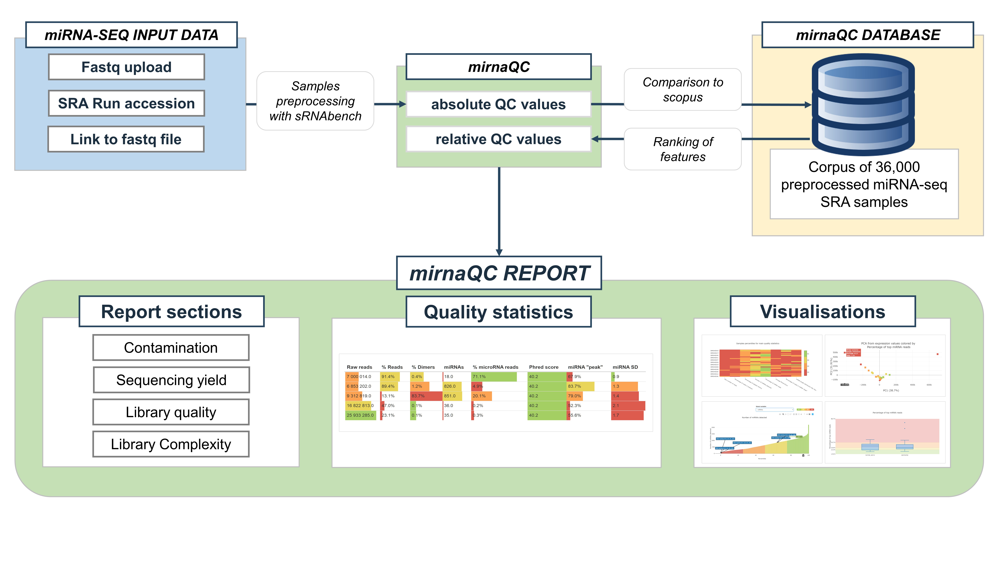

# General Workflow

+ Upload the data
+ Analyze input files with sRNAbench (if species and protocol are not provided → they are guessed)
+ Extract the 34 quality features (observed values per sample)
+ Rank values using the [reference corpus](database.md)
+ Display mirnaQC Report
